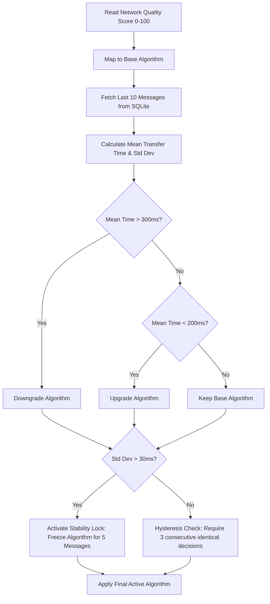

# Adaptive Secure and Speed Communication System (PAACS)

## 📌 About the Project in Brief
The **Predictive Adaptive Algorithm Control System (PAACS)** is a research-grade, full-stack demonstration of **dynamic cryptographic algorithm switching**. Built using Node.js, Express, Socket.IO, and React, it dynamically adjusts the active cryptographic suite (varying from high-security hybrid encryption to lightweight symmetric ciphers) based on real-time Network Quality of Service (QoS) telemetry. By constantly evaluating transfer latency, jitter, packet loss, and stability metrics, PAACS preserves communication speed on congested networks while automatically upgrading to maximum security when network quality recovers.

---

## 📄 Abstract
In modern computer networking, security and performance often sit at opposite ends of a design trade-off. Standard secure communication protocols (like TLS) employ static cryptographic suites that impose fixed processing and transport overhead, regardless of the network state. Under highly degraded, volatile, or bandwidth-constrained network conditions, these static overheads can lead to transmission bottlenecks, high packet retransmission rates, and channel failures. 

This project introduces PAACS, an adaptive communication system that bridges this gap. It employs a multi-tiered cryptographic suite (comprising AES-128, ChaCha20, AES-256, ECC, and a hybrid AES-256 + RSA scheme) and adjusts the active algorithm in real-time according to live QoS indicators. Through a dual-engine control loop, PAACS calculates a compound network quality score and evaluates a rolling average of transmission times. To prevent performance thrashing on boundary conditions, the system implements a standard-deviation-based Stability Lock and a multi-step Hysteresis filter. Experimental results and live web analytics demonstrate that this adaptive model maintains low transmission latency, guarantees integrity validation (via SHA-256 hashing), and secures the channel with periodic key rotation without interrupting communication.

---

## ⚠️ Problem Statement
Standard secure communication protocols operate with static encryption algorithms negotiated at connection startup. This design introduces several vulnerabilities and performance limitations:
1. **Network Performance Degradation**: Under poor signal strength or congestion (high latency, jitter, and packet loss), heavy cryptographic algorithms (such as RSA hybrid schemes) introduce significant computational and packet size overhead, leading to high transmission failures.
2. **Channel Starvation**: Constrained IoT, mobile, or edge devices frequently drop connections entirely because they cannot complete heavy handshakes and packet transfers within time limits.
3. **Rigid Security Posture**: Current protocols lack the intelligence to negotiate security down to keep the channel alive, or conversely, to scale security up to take advantage of high-speed, stable network conditions.
4. **Thrashing and Jitter Vulnerability**: Standard adaptive solutions often suffer from frequent, erratic algorithm switching at boundary points, adding to the system's processing latency instead of alleviating it.

---

## 🎯 Project Objective
The key objectives of this project are:
1. **Dynamic Cryptographic Optimization**: Design a framework that switches cryptographic ciphers adaptively between 5 tiers (ranging from high-overhead hybrid ciphers to lightweight stream ciphers) based on live network quality.
2. **Latency-Corrective Control Loop**: Develop a rolling-window feedback loop that detects transmission bottlenecks (averaging over the last 10 messages) and adjusts the cryptographic complexity accordingly.
3. **Thrashing Mitigation (Stability & Hysteresis)**: Implement a standard-deviation-based Stability Lock and a three-step Hysteresis engine to freeze the active algorithm when network jitter is high, ensuring system stability.
4. **End-to-End Security Assurance**: Ensure message integrity through SHA-256 hash checks, prevent replay and key-compromise attacks via dynamic key rotation (every 5 transmissions), and provide tamper detection.
5. **Telemetry and Visual Analytics**: Create an interactive dashboard (React, Vite, Recharts, Socket.IO) to visualize real-time network states, algorithm transitions, security risks, and full cryptographic audit trails.

---

## 🧠 Methodology & Core Engines

PAACS uses a multi-tier control loop to evaluate network conditions and dynamically negotiate the optimal cipher:



### 1. Cryptographic Suite Mappings
The system supports 5 distinct cryptographic configurations, mapped to network quality score ranges:
*   **AES-256 + RSA (Score $\ge$ 90 - "Excellent"):** Payload encrypted with symmetric `AES-256-CBC`; the symmetric key is encrypted with an RSA-1024 public key.
*   **ECC (Score $\ge$ 75 - "Good"):** Ephemeral ECDH keypair generation (`prime256v1`) is used to derive a shared secret, and the payload is encrypted using `AES-256-CBC`.
*   **AES-256 (Score $\ge$ 60 - "Moderate"):** Pure symmetric block encryption using `AES-256-CBC`.
*   **ChaCha20 (Score $\ge$ 40 - "Weak"):** Optimized stream cipher (`chacha20`), ideal for mobile and low-power CPU environments.
*   **AES-128 (Score < 40 - "Poor"):** Pure symmetric block encryption using `AES-128-CBC` (minimum computational overhead).

### 2. Transfer Time Correction Engine
A rolling database query calculates the average transmission time of the last 10 messages:
*   **Downgrade Trigger**: If the average transfer time exceeds **300 ms**, PAACS immediately shifts to a lighter cipher to bypass network bottlenecks.
*   **Upgrade Trigger**: If the average transfer time falls below **200 ms**, PAACS upgrades the cipher (up to the maximum supported by current network conditions).

### 3. Stability Controller (Freeze Mechanism)
To prevent rapid algorithm switching (thrashing) during high-jitter phases, the system calculates the standard deviation (`stdDev`) of the rolling transfer time. If `stdDev > 30 ms`, PAACS activates a **Stability Lock**, freezing the active cipher for the next **5 transmissions**.

### 4. Hysteresis Controller
To avoid boundary oscillations, any recommended algorithm transition must be selected **3 consecutive times** by the decision loop before the transition is executed.

### 5. Dynamic Key Rotation & Integrity Verification
*   **Key Rotation**: All symmetric keys and asymmetric keypairs (RSA/ECC) are automatically regenerated every **5 messages**.
*   **SHA-256 Integrity Check**: A SHA-256 hash is computed on the ciphertext before transport. If tampering is simulated (by modifying a character in the ciphertext), the receiving node detects a hash mismatch, triggers a UI alert, and flags the message as `[INTEGRITY_CHECK_FAILED]`.

---

## 📐 Architecture Diagram

Below is the system architecture showing the relationship between the client interface, socket communication, backend control loop, SQLite database, and the environment simulator:

```mermaid
graph TB
    subgraph Client-Side (Frontend React SPA)
        Dashboard["Dashboard & Chat Interface"]
        Recharts["Recharts Visualization Engine"]
        CryptoClient["Crypto & Decryption Layer (node-forge)"]
    end

    subgraph Transport / Real-Time Sync
        WebSockets["Socket.IO (Bi-directional Telemetry & Messages)"]
        REST["REST API (Auth, Logs, Simulation Control)"]
    end

    subgraph Server-Side (Backend Node/Express)
        Server["Express.js Server"]
        PAACS["PAACS Controller (paacsSelector.js)"]
        CryptoServer["Crypto & Encryption Layer (node-forge / native crypto)"]
        Simulator["Network Drift Simulator (2s wave cycle)"]
    end

    subgraph Persistence Layer
        SQLite[("SQLite DB (communication.db)")]
        StateJSON["network_state.json"]
    end

    %% Connections
    Dashboard --> CryptoClient
    Dashboard --> Recharts
    CryptoClient <--> WebSockets <--> Server
    Dashboard <--> REST <--> Server
    
    Server --> PAACS
    Server --> CryptoServer
    Server --> Simulator
    
    PAACS <--> SQLite
    Simulator --> StateJSON
    Server <--> StateJSON
```

### Architectural Flow Description
1. **Network Drift**: The Network Drift Simulator continuously calculates drifting network quality (wave cycle) and writes the QoS metrics to `network_state.json`.
2. **Message Send**: When a user sends a message from the React Dashboard, the payload is routed to the Backend Server.
3. **Algorithm Negotiation**: The server queries `network_state.json` and evaluates past telemetry in the SQLite database to run the PAACS decision loop.
4. **Encryption**: The server encrypts the payload using the selected algorithm, generates the SHA-256 hash, and increments key rotations if necessary.
5. **Real-time Delivery**: The encrypted payload is delivered to the client via Socket.IO.
6. **Decryption and Log**: The client decrypts the payload, verifies the SHA-256 hash, and updates both the Chat feed and the Recharts telemetry graphs.

---

## 🏆 Innovative Components (5 Points)
1. **QoS-to-Cryptographic Mapping**: Translates raw network quality indicators (latency, bandwidth, loss, jitter, connection stability, throughput, response time, error rate) into an actionable 5-tier cryptographic scale, maximizing security according to ambient channel capacity.
2. **Dual-Engine Active Telemetry Feedback**: Combines static network-state threshold mappings with a dynamic feedback loop that measures the actual rolling transfer times of the last 10 messages, allowing the system to correct itself under localized server load or link issues.
3. **Standard-Deviation-Based Stability Lock**: Intelligently detects jitter volatility. When variance in transfer time exceeds a threshold (30ms), it freezes the active algorithm for 5 messages, avoiding the CPU and network overhead of frequent cryptographic re-negotiation.
4. **Stateful Hysteresis Debouncer**: Implements a transition delay requiring three consecutive matching recommendations before executing a cipher switch. This mitigates oscillatory algorithm switching at boundary threshold conditions.
5. **Automated Cryptographic Auditing & Tamper Suite**: Employs live key rotation (every 5 packets) synced across sockets and integrates an automated tampering API that modifies ciphertexts mid-transit to test and visually display integrity check failures in real-time.

---

## 🏁 Conclusion
By dynamically adapting cryptographic primitives to match real-time network states, PAACS demonstrates a highly resilient approach to secure communication. The system successfully avoids channel failures and bottlenecks on degraded networks by switching to lightweight stream ciphers (ChaCha20, AES-128). Conversely, it maximizes confidentiality on stable networks by upgrading to robust hybrid systems (AES-256 + RSA). Ultimately, this project proves that security does not need to be disabled under poor network conditions; instead, it can be dynamically and safely optimized.

---

## 🔮 Future Scope
1. **Machine Learning Network Prediction**: Integrate an LSTM (Long Short-Term Memory) network to predict upcoming signal drops or bandwidth spikes based on historical trends, preemptively switching algorithms before latency spikes occur.
2. **Post-Quantum Cryptography (PQC)**: Add next-generation quantum-resistant algorithms (such as Crystals-Kyber or Crystals-Dilithium) to the adaptive cryptographic suite.
3. **Dynamic Packet Fragmentation**: Adapt MTU (Maximum Transmission Unit) sizes along with the algorithm selection to optimize throughput on extremely high-loss channels.
4. **Decentralized Multi-Party Key Exchanges**: Implement decentralized key-rotation mechanisms to distribute trust across multiple validation nodes.
5. **Kernel/OS Protocol Integration**: Port the PAACS control loop into the transport layer (e.g., as a custom QUIC protocol extension or dynamic VPN driver) for native operating system support.

---

## 🛠️ Tools and Technology Stack

The project leverages a robust modern stack to coordinate cryptographic processing, socket communication, database logging, and client-side data visualization:

*   **Backend Core**: **Node.js** (V8 JavaScript engine runtime) & **Express.js** (lightweight web application framework) hosting the communication REST API and server logic.
*   **Real-time Synchronization**: **Socket.IO** (WebSockets wrapper) providing event-driven, low-latency bi-directional synchronization of telemetry, algorithm state updates, and chat messages.
*   **Database Engine**: **SQLite** managed via **`better-sqlite3`** (high-performance, synchronous database driver) for local storage of message logs, latency telemetry, and keys.
*   **Cryptographic Library Suite**: 
    *   **Node.js Native `crypto` Module**: Accesses optimized openSSL ciphers for fast backend-side processing.
    *   **`node-forge`**: A comprehensive pure JavaScript implementation of cryptographic protocols, utilized for browser-side decryption and key generation compatibility.
    *   **Algorithms Used**: RSA-1024 (asymmetric hybrid), ECC / ECDH `prime256v1` (elliptic curve key exchange), AES-256-CBC & AES-128-CBC (block ciphers), ChaCha20 (stream cipher), and SHA-256 (integrity hashing).
*   **Frontend Dashboard**: **React.js** scaffolded via **Vite** for rapid hot-reloads and optimized bundling.
*   **Data Visualization**: **Recharts** (SVG charts library) creating animated, real-time dashboards mapping latency, bandwidth, stability, and cipher adjustments.
*   **Styling System**: **Tailwind CSS** implementing a dark-mode first design system with responsive layouts and active transitions.
*   **Simulation Framework**: **Python 3** interpreter executing offline preset scripts (`simulation/normal.py`, etc.) by writing metric objects directly to the backend cache layer.

---

## 💻 Hardware and Software Requirements

### 1. Software Requirements
*   **Operating System**: Linux (Ubuntu 20.04+, Debian 11+ recommended), macOS Big Sur+, or Windows 10/11.
*   **Runtime Environment**: Node.js `v18.0.0` or higher.
*   **Package Manager**: npm `v9.0.0` or higher.
*   **Python Interpreter**: Python `v3.8` or higher (optional, only required to execute offline simulation scripts).
*   **Web Browser**: Any modern browser supporting WebSockets, CSS Grid, and custom variables (Chrome 90+, Firefox 88+, Safari 14+, Edge 90+).

### 2. Hardware Requirements
*   **Processor (CPU)**: Dual-Core 1.6 GHz or faster x86-64 / ARM64 processor (e.g., Intel Core i3, AMD Ryzen 3, Apple M1).
*   **System Memory (RAM)**: Minimum 4 GB RAM (8 GB recommended for simultaneous execution of frontend development server, backend server, and drift loops).
*   **Storage Space**: Minimum 500 MB of free disk/SSD space (primarily for `node_modules` dependencies and SQLite database growth).
*   **Network Interface**: Standard loopback network adapter (localhost support). Active internet connection is required only for setup and dependency installation.

---

## 🚀 Installation & Local Execution

### Prerequisites
*   Node.js (v18+)
*   npm (v9+)

### Setup Backend
1. Navigate to the backend directory:
   ```bash
   cd backend
   ```
2. Install dependencies:
   ```bash
   npm install
   ```
3. Configure environment variables (optional - default port is 5000):
   ```bash
   cp .env.example .env
   ```
4. Start the backend development server:
   ```bash
   npm run dev
   ```

### Setup Frontend
1. Navigate to the frontend directory:
   ```bash
   cd frontend
   ```
2. Install dependencies:
   ```bash
   npm install
   ```
3. Start the Vite dev server:
   ```bash
   npm run dev
   ```
4. Open [http://localhost:5173](http://localhost:5173) in your web browser.

### Interactive Simulation Commands
All simulation REST routes are public for easy scripting:
*   **Excellent Network**: `curl -X POST http://localhost:5000/simulate/excellent`
*   **Good Network**: `curl -X POST http://localhost:5000/simulate/good`
*   **Moderate Network**: `curl -X POST http://localhost:5000/simulate/moderate`
*   **Weak Network**: `curl -X POST http://localhost:5000/simulate/weak`
*   **Poor Network**: `curl -X POST http://localhost:5000/simulate/poor`
*   **Inject Ciphertext Tampering**: `curl -X POST http://localhost:5000/simulate/tamper`
