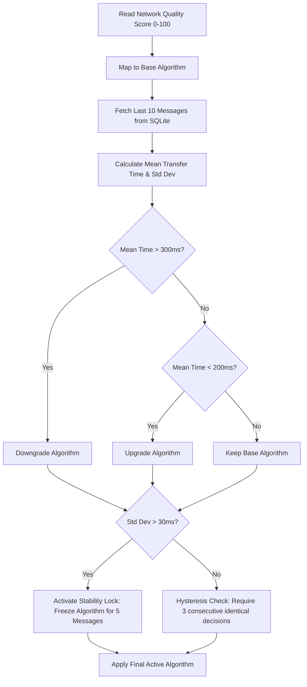

# Adaptive Secure Communication System (PAACS)

A research-oriented full-stack demonstration of **dynamic cryptographic algorithm switching** based on real-time network quality, latency correction, and network stability.

---

## 📌 Project Objective

The system demonstrates a core cryptographic-network trade-off:
> **When network quality degrades, dynamically switching to lighter, faster encryption algorithms maintains communication speed and efficiency, while switching to stronger algorithms under optimal conditions maximizes security.**

---

## 🛠️ Technology Stack

### Backend
*   **Runtime & Server:** Node.js, Express.js
*   **Real-time Communication:** Socket.IO (WebSockets)
*   **Database:** SQLite via [`better-sqlite3`](https://github.com/WiseLibs/better-sqlite3) (for low-overhead persistence)
*   **Cryptographic Suite:** Node.js native `crypto` & [`node-forge`](https://github.com/digitalbazaar/forge)
*   **Authentication:** JSON Web Tokens (JWT)

### Frontend
*   **Framework & Build Tool:** React (Vite)
*   **Styling:** Tailwind CSS (Vanilla CSS configurations)
*   **Data Visualization:** Recharts (for live analytics plotting)
*   **API Client:** Axios
*   **Routing:** React Router DOM (v6)

### Simulation
*   **Background Simulation:** Node.js-based continuous network metric drift
*   **Offline Python Scripts:** Standalone helper scripts (`simulation/normal.py`, `moderate.py`, `slow.py`, `tamper.py`) for offline environment simulation.

---

## 🧠 Methodology & Core Engines

### 1. PAACS (Predictive Adaptive Algorithm Control System)
The algorithm selector (`backend/services/paacsSelector.js`) dynamically switches the active cryptographic cipher using a multi-stage control loop:



#### A. Cryptographic Suite Mappings
The system supports 5 distinct cryptographic setups, mapped to network quality levels:
1.  **AES-256 + RSA (Network Score $\ge$ 90 - "Excellent"):** Hybrid encryption. Symmetric `AES-256-CBC` encrypts the payload, and an RSA public key encrypts the AES key (1024-bit keypair).
2.  **ECC (Network Score $\ge$ 75 - "Good"):** Ephemeral ECDH keypair generation (`prime256v1`), deriving a shared secret, and using `AES-256-CBC` for symmetric encryption.
3.  **AES-256 (Network Score $\ge$ 60 - "Moderate"):** Pure symmetric `AES-256-CBC` encryption.
4.  **ChaCha20 (Network Score $\ge$ 40 - "Weak"):** `chacha20` stream cipher (highly optimized for mobile or CPU-constrained environments).
5.  **AES-128 (Network Score < 40 - "Poor"):** Symmetric `AES-128-CBC` encryption (minimum overhead).

#### B. Transfer Time Correction Engine
A rolling database query calculates the average transmission time of the last 10 messages:
*   **Downgrade Trigger:** If the average transfer time exceeds **300 ms**, PAACS downgrades to a lighter cipher.
*   **Upgrade Trigger:** If the average transfer time falls below **200 ms**, PAACS upgrades to a stronger cipher (up to the maximum supported by current network conditions).

#### C. Stability Controller (Freeze Mechanism)
If the standard deviation (`stdDev`) of the rolling transfer time exceeds **30 ms**, it indicates highly fluctuating jitter or network instability. PAACS activates a **Stability Lock**, freezing the active algorithm for the next **5 messages** to prevent thrashing (frequent algorithm switches).

#### D. Hysteresis Controller
To prevent rapid switching back and forth on boundary conditions, a recommended algorithm change must be selected **3 consecutive times** before the system executes the transition.

---

### 2. Network Quality Drift Simulator
The system includes a continuous network simulation engine (`backend/controllers/networkController.js`) running on an interval of **2 seconds**:
*   **Wave Drift:** The target network quality score continuously drifts in a wave-like cycle between `8` and `96`, moving up or down by `1.5` score units per tick.
*   **Individual Metric Synthesis:** From this target score, 8 realistic network metrics are derived with added random noise:
    *   **Latency:** $350 - Q \times 3.4$ ms ($\pm 25$ ms noise)
    *   **Bandwidth:** $Q \times 0.5$ Mbps ($\pm 4$ Mbps noise)
    *   **Packet Loss:** $8 - Q \times 0.08$ % ($\pm 1$ % noise)
    *   **Jitter:** $60 - Q \times 0.58$ ms ($\pm 4$ ms noise)
    *   **Throughput:** $Q \times 0.45$ Mbps ($\pm 4$ Mbps noise)
    *   **Connection Stability:** $30 + Q \times 0.69$ % ($\pm 8$ % noise)
    *   **Response Time:** $500 - Q \times 4.75$ ms ($\pm 35$ ms noise)
    *   **Error Rate:** $12 - Q \times 0.12$ % ($\pm 1.5$ % noise)
*   **JSON Persistence:** Saves state dynamically to `backend/network_state.json`.

---

### 3. Dynamic Key Rotation
*   Symmetric keys, RSA keypairs, and ECC keypairs are automatically regenerated after every **5 transmissions**.
*   Each rotation increments the `key_id`, logs the event in the `encryption_keys` SQLite table, and emits a `key_rotation` event via WebSockets to synchronize client-side logs.

---

### 4. SHA-256 Integrity & Tampering Simulation
*   A SHA-256 hash is computed from the encrypted ciphertext before transport.
*   **Tamper Injection:** Hitting the `/simulate/tamper` endpoint arms a tamper flag. The next message sent will have its ciphertext string modified (a character flipped mid-string).
*   **Tamper Detection:** The receiving side computes the hash of the incoming ciphertext and compares it with the sent hash. A mismatch flags the message as `[INTEGRITY_CHECK_FAILED]`, broadcasts an alert, and renders a red tamper banner on the UI.

---

## 🗄️ Database Architecture

The SQLite database is located at `backend/database/communication.db`. It contains two primary tables:

### 1. `messages` Table
Stores telemetry and metrics for every single message and file transmission:
*   `sender` / `receiver`: Identifying the endpoints.
*   `message`: Plaintext content (or file meta).
*   `file_name` / `file_size`: Handles file attachment context.
*   `encryption_algorithm`: The cipher selected by PAACS for this message.
*   `encryption_time_ms`, `transfer_time_ms`, `decryption_time_ms`, `total_processing_time_ms`: Precision benchmarking timers.
*   `latency_ms`, `bandwidth_mbps`, `packet_loss_percent`, `network_mode`, `network_quality_score`: Network conditions during the transfer.
*   `stability_score`, `transfer_std_deviation`: Analytics from the PAACS control loop.
*   `message_hash`, `integrity_status`: For verification.
*   `key_id`: References the rotated key index.
*   `security_score`, `risk_level`: Custom safety indicators.
*   `cpu_usage`, `attack_risk`, `algorithm_reason`: Contextual metrics.
*   `sent_message`, `encrypted_message_sent`, `encrypted_message_received`, `decrypted_message`: Full plaintext-to-ciphertext lifecycle audit trails.

### 2. `encryption_keys` Table
Logs key rotation events for auditing:
*   `key_id`: The rotated key identifier.
*   `algorithm`: Target algorithm (marked as `ALL` due to full rotation).
*   `created_at`: Datetime string.
*   `rotation_reason`: Rotation trigger details.

---

## 🖥️ Web Dashboard & UI Pages

### 1. Login Page (`/`)
*   JWT authentication interface.
*   Pre-seeded credentials:
    *   `device1 / password1`
    *   `device2 / password2`

### 2. Live Chat Workspace (`/chat`)
*   **Real-time Messaging:** Chat feed with file upload utility.
*   **Live Network Panel:** Displays live QoS telemetry (latency, bandwidth, loss, jitter, connection stability, throughput, response time, error rate), quality score, and a moving line-graph visualizing the wave drift.
*   **Algorithm Decision Card:** Displays the current active cipher, stability lock details, and the clear textual logic reason provided by PAACS.
*   **Security Score Card:** Displays security ratings (Low, Medium, High risk) and performance parameters.
*   **Integrity Alerts:** Top banner warnings when tampered packets fail decryption.

### 3. Analytics Dashboard (`/analytics`)
Visualizes telemetry records from SQLite using Recharts:
*   **Transfer Time Timeline:** Compares encryption, transfer delay, and decryption processing times.
*   **QoS vs. Algorithm:** Visualizes the dynamic switching boundaries between the 5 ciphers.
*   **Security Score vs. Time:** Tracks historical safety score metrics.

### 4. Cryptographic Lifecycle Log (`/transmission-log`)
A detailed, tabular grid visualizing the raw cryptographic audit trail. Ideal for researchers, it displays:
*   Sender / Receiver.
*   Original message plaintext.
*   Pre-transfer SHA-256 hash.
*   The exact encrypted ciphertext sent by the client.
*   The ciphertext received (highlighting differences with green `✓ Intact` or red `⚠ Tampered` badges).
*   The final decrypted output.

---

## 📡 Simulation & Control API

All simulation REST routes are public (no authentication headers needed) for demonstration scripting:

### 1. Trigger Network Presets
Manually force the simulated network quality to a preset quality score anchor (the JavaScript drift loop will continue to fluctuate around this new anchor):
*   **Excellent Network:**
    ```bash
    curl -X POST http://localhost:5000/simulate/excellent
    ```
*   **Good Network:**
    ```bash
    curl -X POST http://localhost:5000/simulate/good
    ```
*   **Moderate Network:**
    ```bash
    curl -X POST http://localhost:5000/simulate/moderate
    ```
*   **Weak Network:**
    ```bash
    curl -X POST http://localhost:5000/simulate/weak
    ```
*   **Poor Network:**
    ```bash
    curl -X POST http://localhost:5000/simulate/poor
    ```

### 2. Inject Packet Tampering
Arm the tamper simulation. The next single message or file transfer will fail integrity checks:
```bash
curl -X POST http://localhost:5000/simulate/tamper
```

---

## 🚀 Installation & Local Execution

### Prerequisites
*   Node.js (v18+)
*   npm (v9+)

### Setup Backend
1.  Navigate to the backend directory:
    ```bash
    cd backend
    ```
2.  Install dependencies:
    ```bash
    npm install
    ```
3.  Configure variables (optional - default port is 5000):
    ```bash
    cp .env.example .env
    ```
4.  Start development server:
    ```bash
    npm run dev
    ```

### Setup Frontend
1.  Navigate to the frontend directory:
    ```bash
    cd frontend
    ```
2.  Install dependencies:
    ```bash
    npm install
    ```
3.  Start dev environment:
    ```bash
    npm run dev
    ```
4.  Open `http://localhost:5173` in your web browser.
